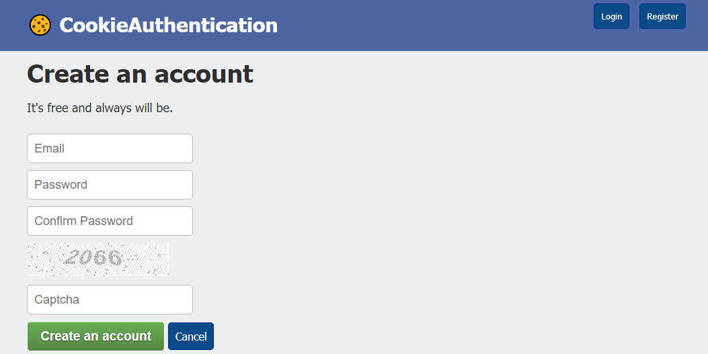

# CookieAuthentication
🍪 Cookie Authentication, Login and Registration - without use  AspNetMembershipProvider (ASP .NET MVC 5 C#)

____
#### Use Automapping   
Used to convert RegisterViewModel.cs model to User.cs
#### Use Custom Сaptcha At Registration

